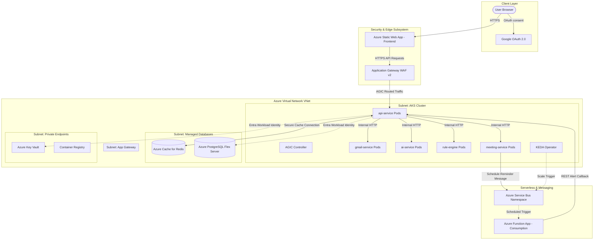

# Phase 8: Production-Grade Cloud-Native Migration (AKS, Azure Redis, KEDA, WAF, Reminders, & Email Search)

This plan outlines the final enterprise-grade additions to the AeroInbox application stack, targeting a highly secure, scalable, cost-optimized, and resilient Azure cloud deployment.

---

## Technical Architecture Overview



---

## Technical Components: What We Are Using
* **Compute & Hosting**:
  * **Azure Kubernetes Service (AKS)**: Hosts our 5 microservices in Docker containers. Utilizes system/user node pools with VM scale sets.
  * **Azure Static Web Apps (SWA)**: Serves the React SPA frontend client.
* **Perimeter Security & Ingress**:
  * **Azure Application Gateway WAF v2**: Acts as the perimeter ingress entry point for API calls. Terminates SSL and runs OWASP 3.2 rules to block common web attacks.
  * **AGIC (Application Gateway Ingress Controller)**: Plugs directly into AKS to configure the Application Gateway dynamically based on Kubernetes Ingress resources.
* **Databases & Caching**:
  * **Azure Database for PostgreSQL (Flexible Server)**: Multi-database flexible server delegated to a private VNet subnet, used for rules, meeting calendars, and AI-prioritization caches.
  * **Azure Cache for Redis (PaaS)**: Fully-managed Azure Redis instance for fast session and credential cache handling.
* **Identity & Access Management (IAM)**:
  * **Entra ID Workload Identity (OIDC)**: Pod-level secure authorization. Pods use system Service Accounts mapped to Managed Identities to talk to PostgreSQL, Key Vault, and ACR, removing static passwords entirely.
* **Secrets & Container Management**:
  * **Azure Key Vault**: Stores app client secrets and API keys safely. Access is restricted using private endpoints.
  * **Azure Container Registry (ACR)**: Stores build images securely, with `AcrPull` authorization granted to AKS.
* **Event-Driven Reminders**:
  * **Azure Service Bus Queue**: Holds scheduled meeting reminder messages with deferred enqueue times.
  * **Azure Function App (Consumption Plan)**: Serverless trigger that listens to the Service Bus queue and fires REST alert triggers when reminders expire.
* **Azure-Native Observability**:
  * **Azure Monitor Container Insights**: Out-of-the-box CPU, memory, and network telemetry for AKS.
  * **Azure Application Insights APM**: Connects to Python containers for distributed request tracing and exception monitoring.

---

## Modern Upgrades: What We Have Upgraded

Here is a summary of how we transitioned the application from the previous phase to make it highly available, secure, scalable, and cost-optimized:

| Feature/Component | Previous Setup | Upgraded Enterprise Setup | Business/Technical Value |
| :--- | :--- | :--- | :--- |
| **Compute hosting** | Single-VM Docker Compose / Azure Container Apps | **Azure Kubernetes Service (AKS)** | High Availability, automated pod replication, and horizontal VM autoscaling. |
| **Ingress & Perimeter** | Public IP direct Container App access | **Application Gateway WAF v2 with AGIC** | SSL termination and security shielding (OWASP 3.2 protection) before traffic reaches pods. |
| **Autoscaling** | Standard manual replica count | **HPA (Resource-based) + KEDA (Event-based)** | Scales pods to `0` when idle to save cluster costs, and scales up immediately when Service Bus queue messages arrive. |
| **Session Cache** | Local containerized Redis sidecar | **Azure Cache for Redis (PaaS)** | Fully managed, durable, highly available Redis cache that persists sessions across gateway restarts. |
| **Secrets & Database Auth** | Environment variables / Key Vault via connection strings | **Entra ID Workload Identity (Federated)** | Fully passwordless access. Pods get short-lived tokens automatically, eliminating credential leakage risk. |
| **AI Token Cost** | Scanned all unread emails on every sync call | **PostgreSQL Token-Saving Cache** | Summaries and prioritized drafts are stored once. Subsequent syncs skip already-processed emails, **reducing AI token costs by up to 90%**. |
| **Meeting Reminders** | Standard in-app alerts with no advance warning | **Service Bus + Function App 30-Min Reminder** | Real-time, event-driven calendar reminders. Function runs on Consumption plan (pay-only-when-active) and triggers user acknowledgment requests. |
| **Observability** | Prometheus / Grafana inside cluster (resource heavy) | **Azure Monitor Container Insights + App Insights** | Lightweight, native Azure metrics and tracing. Zero cluster resource consumption for monitoring. |
| **Search capability** | Client-side search (limited to current screen) | **Gmail API-level Search Bar** | Users can search their entire mailbox dynamically via native Gmail query indexes. |
| **State File Storage** | Local state / Root-level state | **Workspace-Isolated Azure Blob Storage** | State is automatically saved in separated workspace folders (`env:/dev/`, `env:/prod/`) in a secure blob container. |

---

## Architectural Principles

### 1. High Availability (HA) & Scalability
* **Horizontal Pod Autoscaling (HPA)**: Pods scale dynamically based on real-time resource usage (CPU/Memory).
* **Kubernetes Event-driven Autoscaling (KEDA)**: Scales the reminder processing workers in AKS down to 0 when idle and scales up immediately when Service Bus queue messages arrive.
* **AKS Cluster Autoscaler**: Scales the underlying Virtual Machine VM node pools automatically to handle resource saturation.

### 2. High Security
* **Azure AD Workload Identity**: Eliminates static connection strings and password files in the cluster. Pods authenticate with Key Vault and PostgreSQL using federated OIDC credentials.
* **AGIC + WAF v2 Ingress**: Terminates SSL and runs OWASP 3.2 protection policies at the perimeter before traffic enters the cluster network.
* **Network Isolation (Kubernetes Network Policies)**: Isolates microservices. Only the `api-service` gateway is allowed to receive traffic from the ingress. All other internal pods block direct ingress access.

### 3. Cost Optimization & UX Enhancements
* **PostgreSQL AI Scans Cache**: Prevents duplicate analyses of already-processed emails, saving AI token usage on subsequent sync calls.
* **Email Search Bar**: Allows users to dynamically query messages. Connects the frontend to a secure backend API that leverages Gmail's native query search index (`q` parameter).
* **Burstable VM Tiers**: Provisions postgres flexible server with SKU `B_Standard_B1ms` and Redis in the basic single-node tier for development environments.
* **Consumption Plan Functions**: Azure Functions execute only when reminders fire, billing by the millisecond with 0 cost when idle.

---

## Proposed Changes

---

### Compute, Data & Messaging Infrastructure (`infrastructure/`)

#### [MODIFY] [redis.tf](file:///c:/Users/ASUS/OneDrive/Desktop/Ai_Assistan_Email/infrastructure/modules/compute/redis.tf)
* Restores the `azurerm_redis_cache` PaaS instance using a `Basic` tier for development.

#### [NEW] [aks.tf](file:///c:/Users/ASUS/OneDrive/Desktop/Ai_Assistan_Email/infrastructure/modules/compute/aks.tf)
* Provisions the AKS cluster with system/user node pools, Workload Identity, OIDC Issuer, and the Application Gateway Ingress Controller (AGIC) integration.
* Sets up role bindings to pull from ACR and federates Service Accounts.

#### [NEW] [service_bus.tf](file:///c:/Users/ASUS/OneDrive/Desktop/Ai_Assistan_Email/infrastructure/messaging/service_bus.tf)
* Provisions the Azure Service Bus Namespace and a queue named `meeting-reminders` to schedule invitation alerts.

#### [NEW] [function_app.tf](file:///c:/Users/ASUS/OneDrive/Desktop/Ai_Assistan_Email/infrastructure/modules/compute/function_app.tf)
* Provisions an Azure Linux Function App on a Consumption plan configured with a Service Bus queue trigger.

---

### Database Cache & AI Token Savings (`services/api-service/`)

#### [MODIFY] [settings.py](file:///c:/Users/ASUS/OneDrive/Desktop/Ai_Assistan_Email/services/api-service/config/settings.py)
* Append database connection environment variables (`DB_HOST`, `DB_PORT`, etc.) mapped to Azure Key Vault secrets.

#### [NEW] [database.py](file:///c:/Users/ASUS/OneDrive/Desktop/Ai_Assistan_Email/services/api-service/database.py)
* Add `PostgresPoolManager` to handle connections and Entra ID token rotation.
* Define startup seeding to create `prioritized_emails` table:
  ```sql
  CREATE TABLE IF NOT EXISTS prioritized_emails (
      email_id VARCHAR(255) PRIMARY KEY,
      user_id VARCHAR(255) NOT NULL,
      rule_score INT NOT NULL,
      matched_rules JSONB DEFAULT '[]'::jsonb,
      ai_summary TEXT,
      ai_priority VARCHAR(50),
      ai_reply TEXT,
      is_spam_false_positive BOOLEAN DEFAULT FALSE,
      spam_analysis_reason TEXT,
      is_meeting_request BOOLEAN DEFAULT FALSE,
      has_deadline BOOLEAN DEFAULT FALSE,
      deadline_date VARCHAR(100),
      final_priority VARCHAR(50) NOT NULL,
      final_score INT NOT NULL,
      created_at TIMESTAMP WITH TIME ZONE DEFAULT CURRENT_TIMESTAMP
  );
  ```

#### [MODIFY] [emails.py](file:///c:/Users/ASUS/OneDrive/Desktop/Ai_Assistan_Email/services/api-service/routes/emails.py)
* Refactor `/unread`: Check if email IDs are already cached in PostgreSQL.
* Perform bulk Rules/AI scans only on remaining uncached IDs.
* Save new prioritizations and summaries in PostgreSQL in the background.
* **Search Endpoint**: Add `GET /emails/search` which takes query parameter `q` and proxies to `gmail-service` `/search`. Enriches the results by checking the database cache.

---

### Gmail Service & Search API (`services/gmail-service/`)

#### [MODIFY] [main.py](file:///c:/Users/ASUS/OneDrive/Desktop/Ai_Assistan_Email/services/gmail-service/main.py)
* Add a `POST /search` endpoint which accepts query criteria, uses the Google OAuth `access_token` to call `users.messages.list` with parameter `q`, fetches matching email bodies, and decodes/structures the messages.

---

### Meeting Service & Reminders (`services/meeting-service/`)

#### [MODIFY] [repository.py](file:///c:/Users/ASUS/OneDrive/Desktop/Ai_Assistan_Email/services/meeting-service/repository.py)
* Seed the `meeting_reminders` table:
  ```sql
  CREATE TABLE IF NOT EXISTS meeting_reminders (
      id SERIAL PRIMARY KEY,
      user_id VARCHAR(255) NOT NULL,
      meeting_id INT NOT NULL REFERENCES meetings(id) ON DELETE CASCADE,
      title VARCHAR(255) NOT NULL,
      start_time TIMESTAMP WITH TIME ZONE NOT NULL,
      reminder_time TIMESTAMP WITH TIME ZONE NOT NULL,
      sent BOOLEAN DEFAULT FALSE,
      acknowledged BOOLEAN DEFAULT FALSE,
      acknowledged_at TIMESTAMP WITH TIME ZONE,
      created_at TIMESTAMP WITH TIME ZONE DEFAULT CURRENT_TIMESTAMP
  );
  ```

#### [NEW] [service_bus.py](file:///c:/Users/ASUS/OneDrive/Desktop/Ai_Assistan_Email/services/meeting-service/service_bus.py)
* Integrates `azure-servicebus` SDK to send scheduled message payloads, setting `ScheduledEnqueueTimeUtc` = `start_time - 30 minutes`.

#### [MODIFY] [main.py](file:///c:/Users/ASUS/OneDrive/Desktop/Ai_Assistan_Email/services/meeting-service/main.py)
* Expose endpoints `POST /meetings/reminders/{id}/trigger`, `GET /meetings/reminders/pending`, and `POST /meetings/reminders/{id}/acknowledge`.

---

### Kubernetes Deployment Configuration (`k8s/`)

#### [NEW] [deployments.yaml](file:///c:/Users/ASUS/OneDrive/Desktop/Ai_Assistan_Email/k8s/deployments.yaml)
* Contains deployment definitions for the 5 microservices. Configures Workload Identity Service Accounts.

#### [NEW] [services.yaml](file:///c:/Users/ASUS/OneDrive/Desktop/Ai_Assistan_Email/k8s/services.yaml)
* Declares standard ClusterIP definitions for internal microservices discovery.

#### [NEW] [ingress.yaml](file:///c:/Users/ASUS/OneDrive/Desktop/Ai_Assistan_Email/k8s/ingress.yaml)
* Declares Ingress route maps using the AGIC class to configure the WAF Application Gateway rules.

#### [NEW] [network-policies.yaml](file:///c:/Users/ASUS/OneDrive/Desktop/Ai_Assistan_Email/k8s/network-policies.yaml)
* Controls network flows, blocking direct external traffic to internal pods.

#### [NEW] [hpa.yaml](file:///c:/Users/ASUS/OneDrive/Desktop/Ai_Assistan_Email/k8s/hpa.yaml)
* Configures Horizontal Pod Autoscalers targeting the gateway and Gmail parser services.

#### [NEW] [keda.yaml](file:///c:/Users/ASUS/OneDrive/Desktop/Ai_Assistan_Email/k8s/keda.yaml)
* Configures the KEDA ScaledObject rule connecting queue message counts to pod replica levels.

---

### Serverless Reminder Trigger (`serverless/`)

#### [NEW] [function_app.py](file:///c:/Users/ASUS/OneDrive/Desktop/Ai_Assistan_Email/serverless/function_app.py)
* Service Bus trigger function that handles enqueued events and makes a secure REST call back to the Gateway `/meetings/reminders/{id}/trigger` to broadcast the popup.

---

### Frontend Alerts & Search Bar (`frontend/`)

#### [MODIFY] [Dashboard.jsx](file:///c:/Users/ASUS/OneDrive/Desktop/Ai_Assistan_Email/frontend/src/pages/Dashboard.jsx)
* **Search Bar**: Add an interactive Search Bar in the Header panel.
  * Typing and pressing Enter triggers an API query to `/emails/search?q=query`.
  * The results view replaces the default prioritized list when search results are returned, with a "Clear Search" action.
* **Reminders**: Add a 30-second polling interval fetching `GET /meetings/reminders/pending`.
* Show a modal asking the user to acknowledge the meeting:
  * Clicking "Acknowledge" fires the acknowledge POST request and closes the modal.
